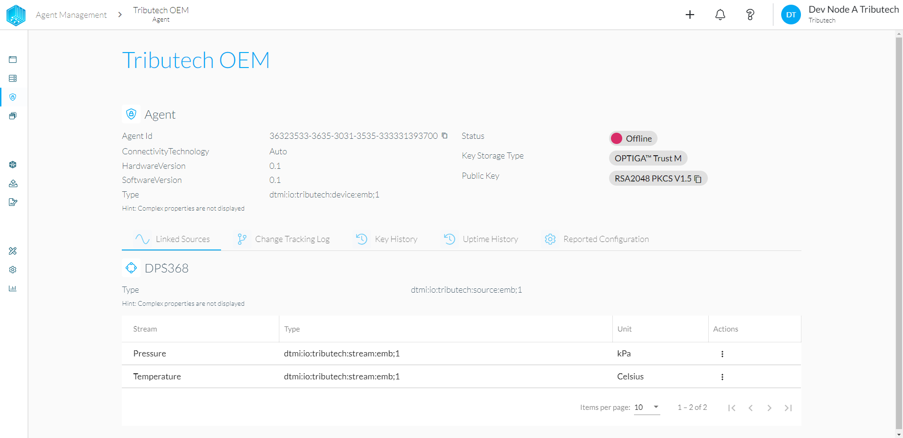
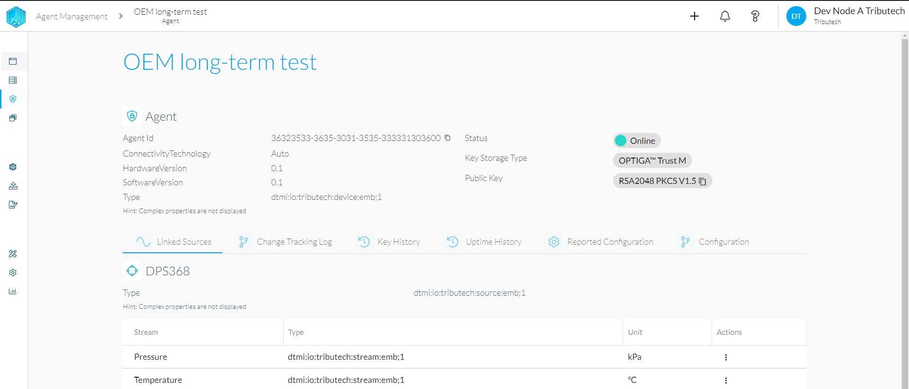
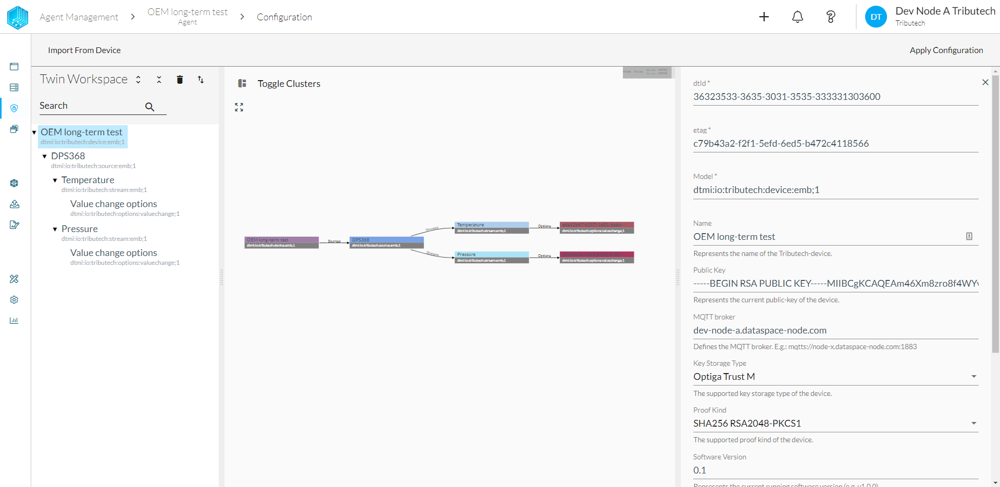
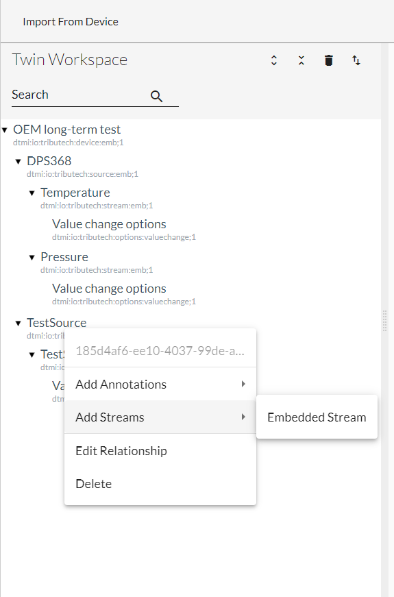
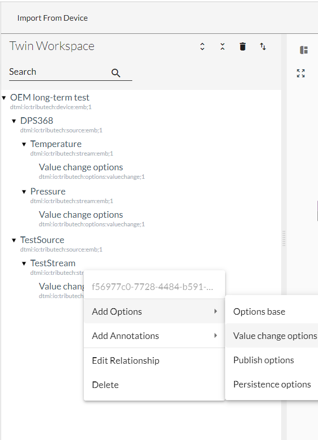

# Tributech OEM Shield sample with nRF52840DK

## Develompment Kit Setup:

### -Pre-Conditions

To be able to use the Tributech OEM shield sample the user needs to assure that all  of the following pre-conditions and resources are at hand.  

* Tributech [OEM Shield](https://tributechwebcontent.blob.core.windows.net/tributech-web-content/Specsheet_2022_OEM.pdf)
* Nordic [nRF52840 Development Kit](https://www.nordicsemi.com/Products/Development-hardware/nrf52840-dk)
* Infineon [My-IoT-Adapter](https://www.infineon.com/cms/de/product/evaluation-boards/my-iot-adapter/)
* Infineon [S2GO-Pressure-DPS368](https://www.infineon.com/cms/en/product/evaluation-boards/s2go-pressure-dps368/)
* Antenna with U.FL connector (LTE CAT-M capable)
* micro LTE SIM card
* USB A to micro USB cable or 5V power adapter with micro USB
* Username and Password for Tributech Data-Space-Admin (DSA) access

### -Setup your development kit

With the following steps the user is able to assemble and start the sample kit. All Development Kits are supplied by Tributech with preprogrammed configurations and for the initial setup no software changes should be needed.

1. Connect your OEM shield with the nRF52840 DK
2. Put the SIM card into the OEM shield
3. Connect the antenna with the OEM shield
4. Stack the My-IoT-Adapter on top of the OEM shield
5. Connect the S2GO-Pressure-DPS368 sensor with the My-IoT-Adapter
6. Supply power to the nRF52840 DK via the micro USB connector
7. switch on the nRF52840 DK with it's power switch on the left lower side of the board

When all steps are completed the green LED of the Tributech OEM shield will blink green when the initialization of the board has been completed successfully. The blue LED will start blinking when a successful LTE CAT-M connection is established.

When all the above steps are completed follow the instructions in [Verify Device2Cloud Communication](#verify-device2cloud-communication).

### -Verify Device2Cloud Communication

The verification of the connection and communication can be done in the Data-Space-Admin.
The user has to access url of the node which is linked to their device and complete the login.
The address always follows the following format:

    node-name.dataspace-node.com

The "node-name" is dependent on the node which is linked to the device.
The main page of the Data-Space-Admin shows multiple sections all with their own information, but for the verification the user needs to look at the left-hand side an click on the "Agents" tap. This tap lists all agents which are linked to the node. They are listed with the following information:

| Name | Type | Status | Key Storage Type | Proofkind |
|------|------|--------|------------------|-----------|

Name depicts the different names of the agents. Type lists the device type of the respective agents. Status shows if the agents is online or offline. Key Storage Type will show the user where the private keys are stored and ProofKind depicts which key format is used for the proof signatures.

Here the user has to select their own device and click on it. This will lead the user to the "Agent Management" page. An example of the agent management page is shown in the following picture:

Since the connectivity already is verified when the device is listed as online the next step is to verify the device communication. This can be done via clicking on the on of the listed streams.
This action will show the stream information and it's associated values link in the picture below:

The stream values will be depicted in a graph or table format below the stream information, the value type is automatically chosen depending on the stream definitions. The values send by a active sample kit should 

## Get started with our project:

### -Setup Dev Environment

To be able to send individual values/streams via the Tributech OEM shield these values have to be transferred to the device via a UART connection. In this sample kit the nRF528

In this sample kit the one normal sequence consists of a sensor gathering call from the nRF2840 DK to the S2GO-DPS368. After that the sensor values are  packaged into a JSON and send to the Tributech OEM shield.
If a user wants to add their own stream to the device a software change on the nrf52840 has to be conducted.

The pivotal point here is the nRF52840 DK so the user has to setup the Nordic development toolchain to be able to engineer a custom software for this board.
The Nordic development tool chain can be obtained on their website:
    
[Nordic nRF Connect for Desktop](https://www.nordicsemi.com/Products/Development-tools/nRF-Connect-for-desktop).

The needed software and toolchain parts can be downloaded in one package. 

### -Configure OEM Module

The Tributech OEm shield only acknowledges values provided via UART which have a valid ValueMetadataId. These ValueMetadataIds are generated automatically when a new stream is added to the Twin configuration of the OEM shield. Thus the user has to configure the OEm shield via the Data-Space-Admin.

The configuration is sent to the OEM shield via a MQTT connection which means the device has to be online for a configuration update. If the device is online a new tap can be seen in the Agent management page called "Configuration". This is depicted in the picture below:

When the configuration tap is accessed the first action is triggered and the configuration is pulled form the linked OEM shield. This configuration is then depicted on the webpage:

Depending on the location where the OEM shield is stationed and the LTE CAT-M connection the configuration pull can last several seconds. 
When the current configuration is shown in the DSA the user can start changing the configuration. The most important part of the configuration change is to add a custom stream.
To be able to add a new stream first the user should add a new source.
To add a new source right-click on the device name and choose "Add Source". Furthermore search for "Embedded Source" this is the only source which can be added to a OEM shield device all other sources will be ignored. 

After the source is added the name of the source can be changed on the right-hand side. The changes have to be finalized by clicking on the "Apply" button on the bottom of the configuration. If the changes are done a stream can be added to the source. Again via right-clicking on the source a dropdown menu is shown. In this menu navigate to "Add Streams" and use the only available option "Embedded Stream". The configuration of the stream follows the same principle as the name change of the Source.

The last change which needs to be done is the addition of the "Value change options". Adding these options is shown in the following picture.

With these changes the configuration can be send to the OEM shield via the "Apply Configuration" button.

### -Provide telemetry data via UART

If the OEM shield configuration is done. The user is able to send data to the device via the UARt connection. The command used for this procedure is "ProvideValues".
A complete "ProvideValues" command looks like the following:

    {"TransactionNr": 14, "Operation": "ProvideValues","ValueMetadataId": "10101010-2020-3030-4040-505050505051", "Values": [{"Timestamp": 1615879096949000000, "Value": "MZiz"}]}

The transaction number is a continuos number which will be given back in the reply to be able to synch the command and the OEM reply. 
The "Operation" depicts the command which should be conducted by the OEM shield. 
The "ValueMetadataId" links the send timestamp and values to the respective stream. 
The "Timestamp" object can be filled with a timestamp in microseconds. If filled with a microseconds value the time is added to the starting date of 1.1.1970. If the timestamp is left at zero the OEM shield attaches the latest timestamp when the value is received.
The last object is "Value", this object holds the value which will be depicted in the Data Space Admin. The value linked to the ValueMetadatId has to be encoded in Base64. Here the user has to be careful since the value ahs to be encoded accordingly. The Base 64 value for 16.5 is "AACEQQ==", but only if the float value is directly encoded. If the value is treated as a string the encoded value will be "MTYuNQ==". If this value is send to the stream this will cause problems in the Data Space Admin, because it will be depicted in the wring format.

### -Consume data via explorer or API

The values presented to the Tributech DataSpace Kit can be consumed in two ways. The first way is get to the data saved by the DataSpace Kit is to access it via the explorer.  Here the data-points can either be viewed in the form of a graph or in form of a table. In the "Agent Management" window of the different agents. Each Stream has its own Graph and table and also its own data audit page, where all the proofs are automatically validated, but can also be validated manually. A more thorough documentation can be found in [Tributech Docs Stream Explorer](https://docs.tributech.io/docs/consume_data/streamexplorer/).

The second way is to access the data via the API functions. A complete documentation for the APi functions can be found at [Tributech Docs API](https://docs.tributech.io/docs/consume_data/api/).